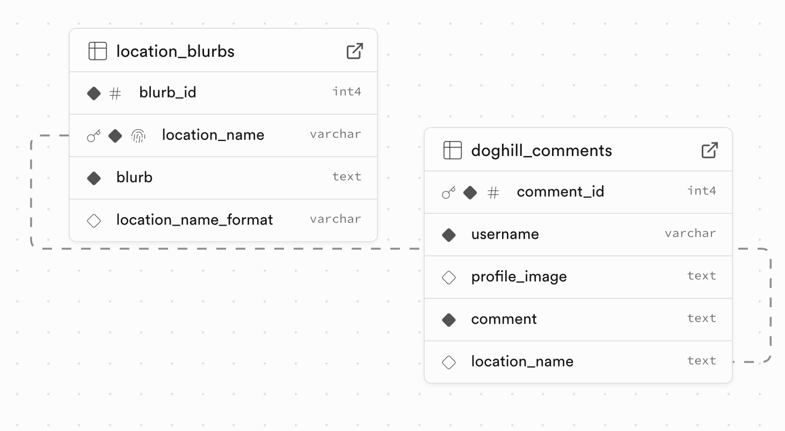
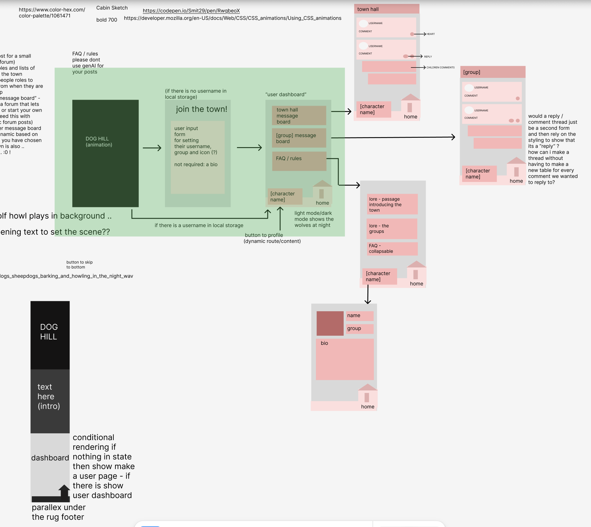

# DOGHILL

Welcome to DOGHILL, a small town nestled beside a healthy perch-river and hidden in the shadows of a dark and unforgiving forest. There's not much to do here: you could spend your time hunting for bones to carve, shopping for local fruit preseves or bakes, or swing by and listen to the band as they play in the town hall!

Just make sure you're inside before the sun sets. Every night wolves circle the town: wade through the river, slink out from the shadows and hunt. Their legs are long, their teeth are sharp, and it's said that once a wolf looks at you, it will come back night after night until it finally catches you.

It's also said that the wolves are not always wolves: that they can become people, and walk about the town in the day.

But that can't be true... right?

## Aims & Planning

This assignment is coming on the heels of a strong "what the heck am I doing" crashout, so I decided to just have fun with it! This meant returning to the Cookie Clicker roots of lore-ifying the assignment, and letting myself really get into making something not incredibly useful, but still cool (to me) and (hopefully) enjoyable for others (b ᵔ▽ᵔ)b

The entire thing may just be a dressed-up version of a CRUD app, but another important aim was that 🗣️ EVERYTHING WOULD ACTUALLY WORK. I'm writing this on Wednesday in my self-reflection time, so I just have to keep my fingers crossed that this aim was successful and do what I can to make sure it was.

Time to take all my hopes and dreams and proceed onto:

## The Design

Now I've had more experience building database-driven apps, I find it easy to keep a schema design in mind while visualising the user journey through the application. This is the approach I'm taking this week: I imagine myself as a user, "clicking through" to the point of completing a form, and make notes of the "pages" they encounter and the tables needed in order to make each particular page work. This is very similar to my experience when writing fiction: it's like I've been given a lego booklet showing the final outcome on the front cover and a list of all the little pieces I will need to put together in order to create that final build. When I sit back and think about that, I think it means my understanding of the building process is getting stronger... at least I am choosing to believe that's what it means 🙂‍↕️

Ok less yapping, more screenshots (and yapping):

This week my database was a LOT more simple than the beast I created last week. As you can see from the image some .. changes happened along the way (namely, the primary key shifting from the id number to the location name in the location table). In general, until I get really really good at this, I think changes in database design are unavoidable, and honestly as long as I can roll with the punches I guess...

The visual design actually went through a few iterations that were all fairly distinct. At the beginning, I was fairly set on making a parallax landing page, with layered (css illustration) background/foreground elements to break up the wall of text, but it was more difficult to optimise than the timeframe allowed me. Next I designed an image-based look for the "town map" page (you can see the remains in my public folder) but images and hosting and I are not the best of friends, as it turns out. I tried multiple different ways and in the end had to admit defeat and removed the images.

The wireframe was chaotic as the iterations kept coming: I had originally made a "screen" for every click I imagined in the users journey, then grouped the first three interactions into the long parallax page in the bottom left. This wireframe does stil hold the building blocks for what the page layouts became, and includes some design that I would really like to go back and implement in the future, for example, the footer which has an image of a house at the right and when "night/dark mode" is activated, the house would be circled by little wolves. There is an early attempt at the footer in the public file, but it was not the approach I wanted to take (I even drew a house with css, but positioning was tough) and so I decided I should focus on actually finishing the tasks at hand.

With only a short time left to complete the assignment I turned toward a graphic style that reminded me of pulp-y horror novels, in both colour and the landing page font. I chose a palette from <a href="https://coolors.co/palette/220901-621708-941b0c-bc3908-f6aa1c">Coolors</a> and checked the ideal text colour choice on the <a href="https://webaim.org/resources/contrastchecker/"> WCAG Contrast Checker</a> to make sure that my colour scheme would be user-friendly, particularly sice this is a reading-heavy app.

I did fret over the reading-heavy portions, especially because thanks to the way I had stored & displayed the dynamic location storybeats, splitting up the paragraphs was difficult. I increased the line height so that the text would be spaced out, and a stretch goal is to add an accessibility toggle to <a href="https://dyslexiefont.com">change fonts.</a> That being said I am reminding myself that it is very possible that the people who would want to use a text-based role playing app in this day and age also may not mind a little old-school "wall of text" styling. And maybe I can even say it's intentional.

## The Building

Dare I say that building went... well??

I had a working MVP with most of the necessary features by Friday evening, which is quick (for me) and had a version hosted before the end of the day. That was a massive boost to my confidence because it marks the first database-driven app with full functionality that I have managed to host correctly. (Please say I have hosted it correctly...)

The most confused I was throughout the entire process was slowly coming to the realisation that the mapping was looking for the locatoin name, not the ID. Instead of going back and fixing what it was looking for, I changed the formatting in the database (no spaces) and since the users would never be able to interact with that table declared it "good enough" before then making it even more hacky by adding a user-friendly formatted column. If I was sytarting again I would take more care to ensure that everything was looking for what I expect it to look for, but I think I would need a blank slate in order to explore what went wrong here as I'm losing the forest for the trees I think.

Here and there I had some issues with syntax, and there were certainly issues with the Image component. There are bones of what approaches I tried to take within my code, but I was unwilling to really push once I had started on any debug attempt as I didn't want to break the entire thing.

I started exploring Motion and had a lot of fun adding a lot of animations (in CSS as well) like skewing the links on hover, but then I realised how annoying the site would be to navigate and stopped having fun in favour of a good user experience. In some ways I think the animation makes up for the lack of images, but in an ideal world I could have it ALL.

## Reflections

I honestly get kind of scared to say that I think this went well because I'm cautious of jinxing the whole thing. That being said, I really enjoyed building this, and although I'm not in love with the final product I had fun getting there. Which is more important than my feelings on the final product. To me.

Of course, I have already listed places where the app could be improved upon and if you give me 5 minutes I could probably double that list, but it was kind of incredible to actually be able to link my app to people and have them 1. see comments, 2. leave comments and not to forget 3. see anything at all!

٩(◕‿◕｡)۶

## References and Resources

⭐️ <a href="https://icon-icons.com/icon/wolf-howl/38004"> Howling Wolf Icon</a>

⭐️ <a href="https://webaim.org/resources/contrastchecker/"> WCAG Contrast Checker</a>

⭐️ <a href ="https://coolors.co/palette/220901-621708-941b0c-bc3908-f6aa1c">Coolors</a>

⭐️ <a href="https://dyslexiefont.com">Dyslexie Font</a>

⭐️ <a href="https://nextjs.org">Next Docs</a>

⭐️ <a href="https://motion.dev">Motion Docs</a>
